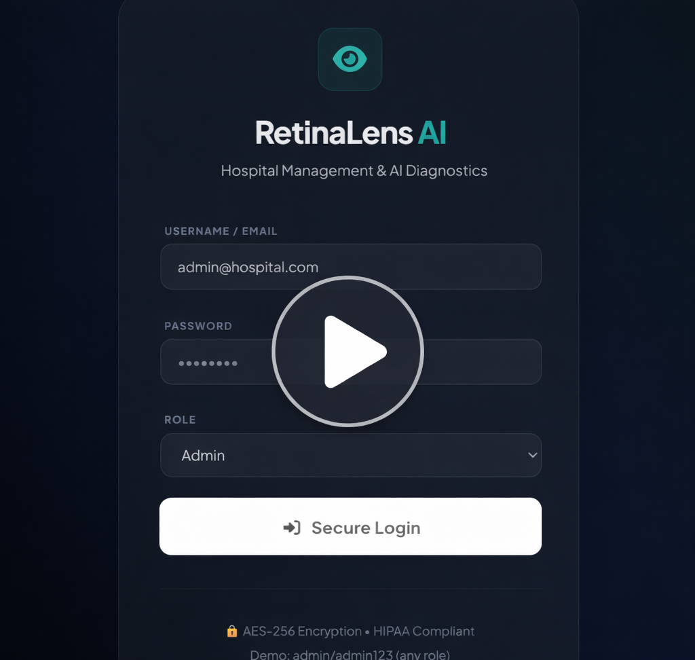

# 👁️ RetinaLens AI — Diabetic Retinopathy Detection


**Core Stack:** Python · PyTorch · EfficientNet-B4 · Flask · Grad-CAM · OpenCV

An end-to-end deep learning system for **automated diabetic retinopathy severity grading** from fundus photographs, trained on **115,241 real clinical images** from three major datasets. Deployed as a full hospital management web application with **Grad-CAM explainability**, retinal image validation, and a 5-class severity grading system.


---

## 📋 Table of Contents
- [Results](#results)
- [How to Run](#how-to-run)
- [Overview](#overview)
- [Dataset](#dataset)
- [Methodology](#methodology)
- [Model Architecture](#model-architecture)
- [Training Details](#training-details)
- [Grad-CAM Explainability](#explainability-with-grad-cam)
- [Web Application](#web-application)
- [Watch The Full Demo Video](#demo-video)
- [Limitations](#limitations)
- [Future Work](#future-work)
- [Disclaimer](#disclaimer)

---

## Results

Trained for 16 epochs on 115,241 fundus images across three clinical datasets. Performance is consistent with published research on this task, a 5-class DR grading on real clinical data is an inherently difficult problem.

| Metric | Score |
|---|---|
| Validation Accuracy | **64.9%** |
| Macro F1 Score | **58.79%** |
| Best Epoch | Epoch 14 |
| Training Images | 115,241 |

### Per-Class F1 at Best Epoch

| Grade | Class | F1 Score |
|---|---|---|
| Grade 0 | No DR | 0.775 |
| Grade 1 | Mild | 0.461 |
| Grade 2 | Moderate | 0.488 |
| Grade 3 | Severe | 0.511 |
| Grade 4 | Proliferative | 0.631 |

> Published benchmarks on the same combined dataset (EyePACS + APTOS + MESSIDOR) report 60–70% accuracy for 5-class grading — results here are within that range.

---

## How to Run

### Prerequisites
- Python 3.10 or higher
- Git

### 1. Clone the repository

```bash
git clone https://github.com/egwaojeangel/diabetic_retinopathy_detection_using_efficientnet.git
cd diabetic_retinopathy_detection_using_efficientnet
```

### 2. Create a virtual environment

```bash
python -m venv venv

# Windows
venv\Scripts\activate

# Mac/Linux
source venv/bin/activate
```

### 3. Install dependencies

```bash
pip install -r requirements.txt
```

### 4. Download the model weights

Download `best_model.pth` from the Kaggle output tab of the training notebook and place it in the repo root.

### 5. Run the web application

```bash
python webapp.py
```

Open your browser at: **http://127.0.0.1:5000**

---

## Overview

Diabetic retinopathy is one of the leading causes of preventable blindness worldwide, affecting over 100 million people with diabetes. Manual grading of fundus images is time-consuming and requires trained ophthalmologists, which is a resource not always available in underserved regions.

This project builds an end-to-end screening pipeline that:
- Grades DR severity across **5 clinical stages** automatically
- Uses **Grad-CAM** to show which retinal regions drove each prediction
- Validates that uploaded images are actual fundus photographs before running inference
- Presents results inside a full **hospital management interface** with patient records, analytics, and clinical recommendations

### DR Severity Classes

| Grade | Stage | Recommendation |
|---|---|---|
| 0 | No DR | Routine annual screening |
| 1 | Mild | Optimise blood sugar control, re-screen in 12 months |
| 2 | Moderate | Refer to ophthalmologist, re-screen in 6 months |
| 3 | Severe | Urgent ophthalmology referral within 4 weeks |
| 4 | Proliferative DR | Immediate referral — risk of vision loss |

---

## Dataset

Training used a combined dataset of three major clinical sources:

| Dataset | Description |
|---|---|
| EyePACS | Large-scale US screening programme |
| APTOS 2019 | Kaggle competition dataset from India |
| MESSIDOR | French ophthalmology research dataset |

| Split | Images |
|---|---|
| Training | ~92,000 |
| Validation | ~23,000 |
| **Total** | **115,241** |

> ⚠️ Dataset not included in this repository due to size and licensing.  
> Available at: [Kaggle – EyePACS + APTOS + MESSIDOR](https://www.kaggle.com/datasets/ascanipek/eyepacs-aptos-messidor-diabetic-retinopathy)

---

## Methodology

### Image Preprocessing
- Resized to **260 × 260 pixels** (EfficientNet-B4 input size)
- RGB format with ImageNet normalisation
- Tensor conversion via PyTorch transforms

### Data Augmentation (Training Only)
- Random horizontal and vertical flipping
- Random rotation (±15°)
- Brightness, contrast, and saturation jitter
- Random affine transforms

### Retinal Image Validation
Before inference, images are validated as genuine fundus photographs using three checks:
1. **Dark border / bright centre** — fundus images always have a black background with a bright circular retinal disc
2. **Circular region detection** — the retinal disc must occupy at least 20% of the image
3. **Red/orange colour profile** — fundus images have a characteristic warm colour tone

Non-fundus images are rejected before reaching the model.

---

## Model Architecture

**EfficientNet-B4** — pretrained on ImageNet, fine-tuned for 5-class DR grading.

| Component | Detail |
|---|---|
| Backbone | EfficientNet-B4 (timm) |
| Input Size | 260 × 260 |
| Output Classes | 5 |
| Dropout | 0.4 |
| Drop Path Rate | 0.2 |
| Pretrained | ImageNet |

EfficientNet scales network depth, width, and input resolution simultaneously using a compound coefficient. B4 was chosen for its higher capacity to capture fine retinal features such as microaneurysms, haemorrhages, and neovascularisation.

---

## Training Details

| Parameter | Value |
|---|---|
| Framework | PyTorch + timm |
| Loss Function | Cross-Entropy Loss |
| Optimizer | AdamW |
| Learning Rate | 1e-4 |
| Scheduler | CosineAnnealingLR |
| Epochs Completed | 16 / 50 (Kaggle timeout) |
| Best Epoch | 14 |
| Early Stopping Patience | 10 |
| Batch Size | 32 |
| Hardware | Kaggle GPU (P100) |
| Training Time | ~12 hours |

Training was run on Kaggle with a 12-hour GPU session limit. Early stopping patience was at 2/10 when the session timed out, indicating the model was still learning.

---

## Explainability with Grad-CAM

A proper **Grad-CAM** implementation is integrated using forward and backward hooks on EfficientNet-B4's last convolutional block.

### How it works

1. Forward hook saves feature map activations from the last conv block
2. Backward hook saves gradients flowing into that layer
3. Gradients are globally average-pooled to produce per-channel importance weights
4. Activations are weighted and summed → ReLU → normalised to [0, 1]
5. CAM is resized to the original image dimensions
6. An **eye mask** is applied — the CAM is zeroed outside the retinal disc before the JET colormap is applied, preventing hotspots from bleeding into the black background
7. The masked heatmap is blended onto the original fundus image

This approach follows the original Grad-CAM paper (Selvaraju et al., 2017) and allows clinical users to verify the model is attending to meaningful retinal structures.

---

## Web Application

A full **hospital management interface** built with Flask + TailwindCSS:

- 🔐 Secure login system
- 👥 Patient record management
- 🔬 AI retinal scan analysis with Grad-CAM visualisation
- 📊 Probability distribution chart per prediction
- 📋 Clinical recommendations per DR grade
- 📈 Analytics dashboard with disease distribution
- ⚠️ Medical disclaimer on all AI outputs

```bash
python webapp.py
```

### Demo Video

[](https://drive.google.com/file/d/1xroETJz2pSxljJKXd7kL7IyyaRJQn3lQ/view?usp=sharing)

Click the thumbnail above to watch the full system demo.

---

## Requirements

```
torch
torchvision
timm
flask
flask-cors
numpy
Pillow
opencv-python
scikit-learn
matplotlib
```

```bash
pip install -r requirements.txt
```

---

## Limitations

- Trained on preprocessed images — performance may vary on raw clinical fundus photos
- Session timed out at epoch 16/50 — model likely underfit relative to its potential
- No external test set evaluation beyond the validation split
- No cross-dataset generalisation study
- Not validated by clinical ophthalmologists
- Not approved for clinical use

---

## Future Work

- Resume training to full 50 epochs with class-weighted loss
- External validation on unseen datasets (Messidor-2, DIARETDB)
- Larger EfficientNet variants or Vision Transformer backbone
- Cloud deployment (Hugging Face Spaces / Render)
- Structured clinical report generation per patient

---

## Disclaimer

> ⚠️ This AI system is intended **solely to assist qualified healthcare professionals** and does not replace clinical judgement. All outputs must be reviewed and validated by a licensed medical professional before being used in any clinical decision-making process.

---

## Author

**Angel Egwaoje**  

Machine Learning Engineer | Medical Imaging & Computer Vision  


[](https://www.linkedin.com/in/angel-egwaoje-416927280)
[](https://github.com/egwaojeangel)
